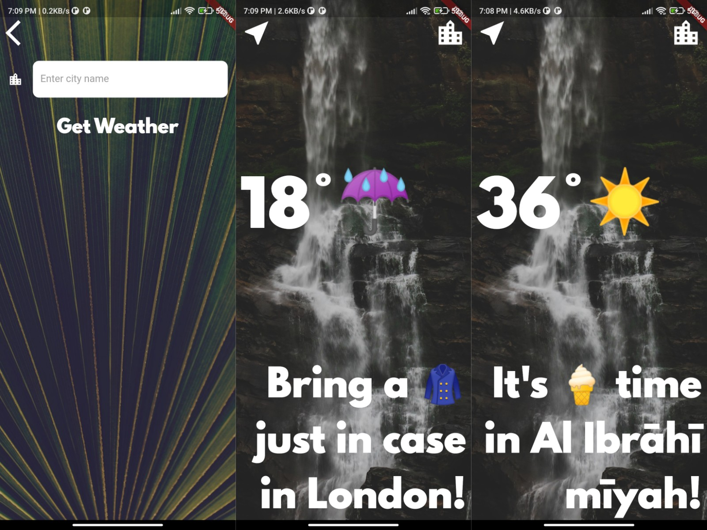

# Clima Weather Flutter

A weather app built with Flutter that provides current weather conditions and forecasts for various locations.

## Screenshots


## Features
- Get current weather conditions (temperature, weather description, wind speed, humidity, etc.).
- View 7-day weather forecast for the selected location.
- Search for weather information for different cities.
- Automatic location detection based on user's GPS coordinates.
- Responsive layout design.

## Installation
1. Clone the repository:
```bash
git clone https://github.com/SaherMuhamed/clima-weather-flutter.git
```

2. Install dependencies:
```bash
flutter pub get
```

3. Obtain an API key:
   - Visit the OpenWeatherMap website.
   - Sign up for a free account and obtain an API key.

4. Set the API key:
   - Open the `lib/services/weather.dart` file.
   - Replace **'YOUR_API_KEY'** with your actual OpenWeatherMap API key.

## Dependencies
This project uses the following dependencies:
- flutter - Flutter framework.
- http - Package for making HTTP requests.
- geolocator - Flutter plugin for accessing GPS location information.
- flutter_spinkit - Loading spinner animation package.

## Author
This project was developed by **Saher Muhamed** @ 14/14/2023.